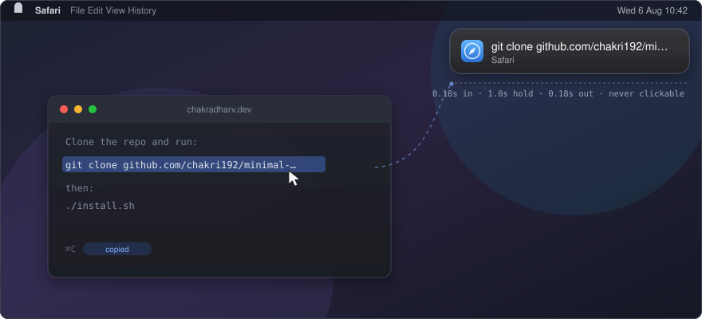
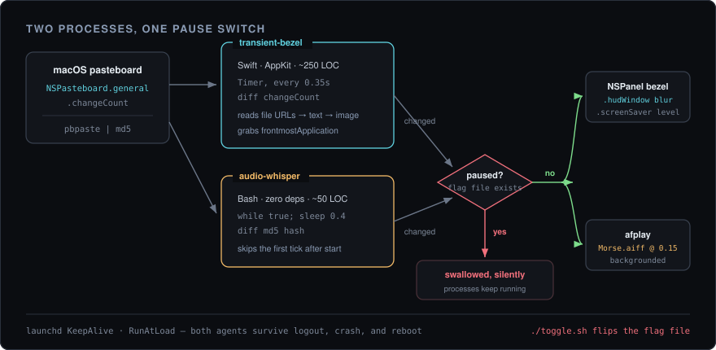

<div align="center">

# minimal-notifications

**Two macOS clipboard indicators that never ask to be dismissed.**

A quiet sound, or a flash of the real system HUD. No banner, no Notification Center entry, no click.

<p>
  
  
  
  
  
</p>

<br />



<sub>You press ⌘C. The bezel fades in, tells you what it caught and which app it came from, and is gone before you look away.</sub>

</div>

<br />

---

## The short version

A copy confirmation is the smallest notification there is, and macOS still turns it into an event — a banner that slides in, sits there, and stacks up in Notification Center until you go clear it. These two tools go the other way: acknowledge the copy, then get out of the way completely.

**audio-whisper** plays a quiet sound. That is the entire feature. 46 lines of Bash, no dependencies, nothing on screen.

**transient-bezel** flashes the same floating HUD macOS uses for volume and brightness — same `NSVisualEffectView` material, same blur — showing a preview of what you copied and the icon of the app you copied it from. Then it fades. It is never clickable, never focusable, and leaves nothing behind.

Run either. Run both. One command silences them together when you're sharing your screen.

```zsh
git clone https://github.com/chakri192/minimal-notifications.git
cd minimal-notifications && ./install.sh
```

That builds the Swift binary, installs both tools, and registers `launchd` agents so they come back after a reboot. Pass `audio` or `bezel` to install just one.

---

## What each one does

|  | audio-whisper | transient-bezel |
|---|---|---|
| Feedback | a sound, nothing visual | a HUD bezel, no sound |
| Language | Bash, 46 lines | Swift + AppKit, 245 lines |
| Dependencies | none — `afplay` ships with macOS | Command Line Tools to build, none to run |
| Change detection | `pbpaste \| md5` | `NSPasteboard.changeCount` |
| Text copied | yes | yes, with a 40-char preview |
| Files copied in Finder | yes | yes — the filename, or "3 files copied" |
| Image or screenshot copied | **no** — `pbpaste` prints nothing, so the hash never moves | yes — "Image copied" |
| Re-copying identical text | **no** — same hash, reads as no change | yes — `changeCount` still increments |
| Shows the source app | — | yes, icon and name |

Those two "no" rows are a real limitation rather than something to discover later. Hashing `pbpaste` is exactly what makes audio-whisper dependency-free, and the price is that it only sees what `pbpaste` can print. If you want a signal on screenshots, run the bezel — or run both and let the bezel cover the gap.

---

## How it works

<div align="center">

</div>

Both tools are polling loops. Neither hooks the pasteboard, because macOS publishes no change notification for it — polling is the only honest option, and at 0.35–0.4s it costs nothing measurable.

**The first tick never fires.** Both watchers seed a baseline at startup and compare against it, so launching an agent doesn't announce whatever happened to already be on your clipboard.

**The pause switch is a file, not a signal.** `./toggle.sh` creates or removes `~/.config/minimal-notifications/paused`, and both loops check for it every tick. Pausing is instant and symmetric, and nothing is stopped or restarted — the agents stay up and simply go quiet. Useful right before a screen recording.

**The source app is whoever is frontmost.** The bezel sets its activation policy to `.accessory`, so it has no Dock icon, no menu bar item, and can never become frontmost itself. That makes "the frontmost app at the moment the pasteboard changed" a reliable stand-in for "the app you copied from".

### The two details that took the longest

**Staying above fullscreen.** An ordinary window vanishes the moment you enter a fullscreen app. The bezel uses window level `.screenSaver` with a collection behavior of `[.canJoinAllSpaces, .stationary, .ignoresCycle]`, so it draws over fullscreen video and over Mission Control, without dragging itself into the window cycle.

**Not hopping when the menu bar hides.** The obvious way to anchor a top-corner window is `screen.visibleFrame`, which already excludes the menu bar. But with menu bar auto-hide enabled `visibleFrame` grows and shrinks, and the bezel would visibly jump depending on where your mouse happened to be. It anchors off `screen.frame` plus `NSStatusBar.system.thickness` instead, which is constant. Bottom corners still use `visibleFrame` — down there the thing to clear is the Dock.

---

## Configuration

Nothing needs configuring. Everything can be.

### transient-bezel

Options are read through `UserDefaults`, so they are plain `-key value` arguments — no recompile, no config file.

```zsh
~/apps/clipboard-bezel/clipboard-bezel -position bottom-right -duration 1.5 -width 320
```

| Flag | Default | Meaning |
|---|---|---|
| `-position` | `top-right` | `top-right`, `top-left`, `bottom-right`, `bottom-left` |
| `-duration` | `1.0` | Seconds held at full opacity |
| `-fade` | `0.18` | Fade in / out duration |
| `-poll` | `0.35` | Seconds between pasteboard checks |
| `-width` · `-height` | `300` · `56` | Bezel size, in points |
| `-radius` · `-margin` | `14` · `16` | Corner rounding · distance from the screen corner |
| `-preview` | `40` | Characters of text preview before truncating |

To make a flag permanent, add it to `ProgramArguments` in `~/Library/LaunchAgents/com.user.clipboard-bezel.plist` and reload the agent.

### audio-whisper

Options are environment variables.

| Variable | Default | Meaning |
|---|---|---|
| `SOUND` | `/System/Library/Sounds/Morse.aiff` | Anything `afplay` can play |
| `VOLUME` | `0.15` | `0.0` silent → `1.0` full |
| `POLL_INTERVAL` | `0.4` | Seconds between checks |
| `PAUSE_FILE` | `~/.config/minimal-notifications/paused` | Shared pause flag |

```zsh
SOUND=/System/Library/Sounds/Tink.aiff VOLUME=0.3 ~/scripts/clipboard-audio-whisper.sh &
```

`ls /System/Library/Sounds/` for the full set. `Pop`, `Tink`, and `Morse` are the ones that don't sound like an error.

---

## Everyday use

```zsh
./toggle.sh              # pause both — run again to resume
./install.sh bezel       # rebuild and reinstall after editing main.swift
./uninstall.sh           # stop the agents and remove every installed file
```

Check they're alive, or read what they logged:

```zsh
launchctl list | grep clipboard
tail -f /tmp/clipboard-bezel.err /tmp/clipboard-audio-whisper.err
```

### Trying it without installing anything

```zsh
./audio-whisper/clipboard-audio-whisper.sh &
swiftc transient-bezel/main.swift -o /tmp/clipboard-bezel -O && /tmp/clipboard-bezel &
```

`pkill -f clipboard-audio-whisper` and `pkill -f clipboard-bezel` to stop them again.

---

## When something is off

| Symptom | Cause |
|---|---|
| Neither one fires | They're probably paused. Run `./toggle.sh`, or look for `~/.config/minimal-notifications/paused` |
| No sound, bezel fine | `VOLUME` is `0`, or `SOUND` points at a file that isn't there — the script prints the available sounds and exits when so |
| Bezel never appears | A stale binary from an earlier build. Re-run `./install.sh bezel`, which recompiles before it installs |
| Bezel overlaps the menu bar | Raise the `topInset` offset in `main.swift` — it is `NSStatusBar.system.thickness + 10` |
| Agent won't load | `launchctl bootstrap` fails if the label is already loaded. `launchctl bootout gui/$(id -u)/<label>` first — this is exactly what `install.sh` does for you |
| Two bezels at once | `pgrep -fl clipboard-bezel` to confirm, `pkill -f clipboard-bezel` to clear, then reinstall |

---

## Layout

```
minimal-notifications/
├── install.sh                 # build → install → bootstrap launchd   [audio|bezel|all]
├── uninstall.sh               # bootout → remove every installed file
├── toggle.sh                  # create/remove the shared pause flag
├── transient-bezel/
│   ├── main.swift             # bezel window, pasteboard watcher, config
│   └── com.user.clipboard-bezel.plist
├── audio-whisper/
│   ├── clipboard-audio-whisper.sh
│   └── com.user.clipboard-audio-whisper.plist
└── docs/                      # the diagrams in this README
```

`install.sh` substitutes your username into the plists before copying them into `~/Library/LaunchAgents/`, so the files in the repo stay generic. It also `bootout`s any existing agent before `bootstrap`ing, which is why re-running it is always safe.

Installed paths are `~/scripts/clipboard-audio-whisper.sh` and `~/apps/clipboard-bezel/clipboard-bezel`. `uninstall.sh` removes exactly those and nothing else.

---

## Requirements

macOS 12 or newer. audio-whisper needs nothing further. transient-bezel needs the Xcode Command Line Tools to compile — `xcode-select --install` — but not full Xcode, and once built the binary depends on nothing beyond system frameworks.

---

## License

MIT — see [LICENSE](LICENSE).
